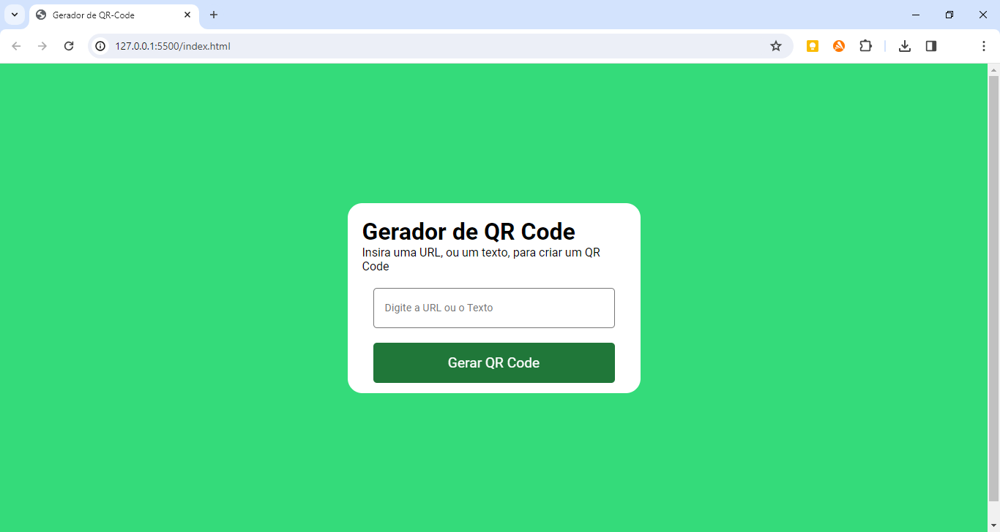

### Qr Code Generator Front-End

Exercitando um pouco habilidades de Front End para desenvolver um gerador de Qr Code Simples usando HTML, CSS e Javascript, e consumindo a API do Google (em https://goqr.me/api/).

No Javascript foi usado querySelector para selecionar elementos no DOM e addEventListener para aguardar eventos.

Vc pode escrever textos ou URL's, por exemplo, dentro da caixa de input e clicar no botão "Gerar QR Code" para ter um QR Code produzido.

📱

